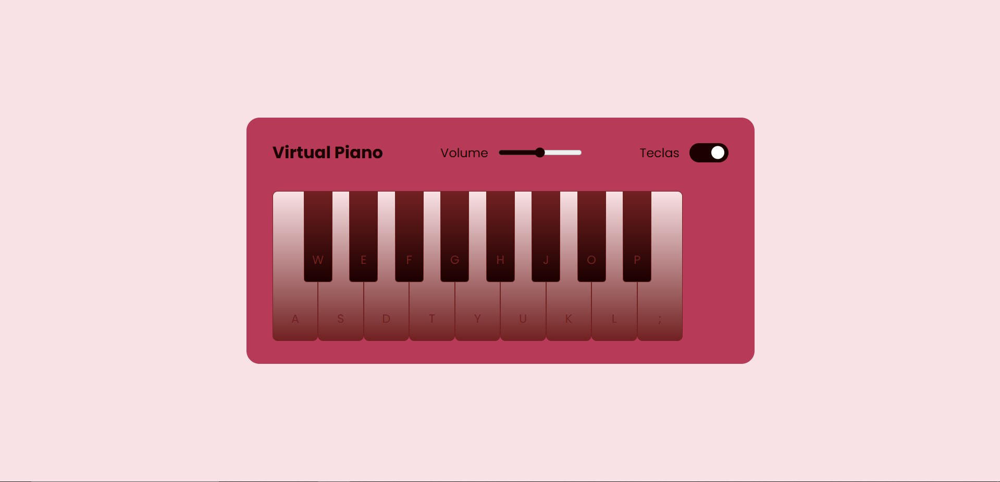

# 🎹 Simulador de Piano Virtual

O **Simulador de Piano Virtual** é um piano interativo e simples baseado na web. Este projeto permite que você toque melodias diretamente no teclado do computador ou clicando nas teclas do piano. Personalize sua experiência com controle de volume e alternância de exibição de teclas. 🎶

## 🌟 Funcionalidades
- 🎵 **Teclas Tocáveis**: Use o teclado ou o mouse para tocar.
- 🔊 **Controle de Volume**: Ajuste o volume com o controle deslizante.
- 🔄 **Alternar Rótulos das Teclas**: Mostre ou oculte os rótulos das teclas no piano.
- 🎨 **Interface Estilosa**: Design moderno, limpo e responsivo.

## 🚀 Experimente Agora
Acesse a versão online do Simulador de Piano Virtual diretamente pelo GitHub Pages:  
[🎹 Simulador de Piano Virtual](https://joycedev13.github.io/simulador-de-piano/)

## 🛠️ Tecnologias Utilizadas
- **HTML**: Estrutura do aplicativo.
- **CSS**: Estilo para uma interface elegante e moderna.
- **JavaScript**: Adiciona interatividade ao piano.

## 🎯 Como Tocar
- **Mouse**: Clique nas teclas do piano para tocar.
- **Teclado**: Pressione as teclas correspondentes (por exemplo, `A`, `S`, `D`, etc.) para tocar as melodias.
- **Volume**: Ajuste o controle deslizante para alterar o volume.
- **Rótulos das Teclas**: Use a caixa de seleção para alternar a exibição dos rótulos das teclas.

## 🎨 Pré-visualização
  
*Exemplo de captura de tela do Simulador de Piano Virtual.*

## 🙌 Contribuição
Contribuições são bem-vindas! Sinta-se à vontade para fazer um fork do repositório e enviar um pull request.
